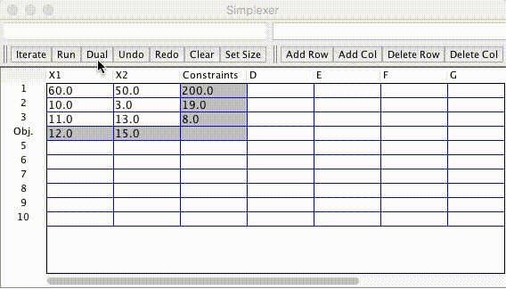

# Simplex-Method
A learning tool that performs the simplex method.

Creates a window containing grid cells representing the input simplex tableau. There are buttons for single-step iteration, iteration to completion, resizing, and undoing. It's still a work in progress, so I expect bugs to arise as it gets used more.

The editor also supports common math functions through [mXparser](http://mathparser.org/).

Here, the program solves the problem:

    Minimize -4X1 - 6X2
    
    Subject to 
    
     -X1 +   X2 + S1       = 11
    
      X1 +   X2 +     S2   = 27
    
    2 X1 + 5 X2 +       S3 = 90
    
    X1, X2, S1, S2, S3 >= 0
    
    
Where S1, S2, S3 are slack variables added to put this in standard form.

This program now supports dual programs! You must put it into the form

    Minimize f(x,...)
    
    Subject to
    
    Ax >= b
   
Example:

    Minimize 12 X1 + 15 X2
    
    Subject to
    
    60 X1 + 50 X2 >= 200
    10 X1 +  3 X2 >= 19
    11 X1 + 13 X2 >= 8
    X1, X2 >= 0
    

 
