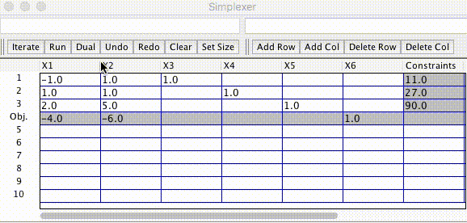

# Simplex-Method
A learning tool that performs the simplex method.

Creates a window containing grid cells representing the input simplex tableau. There are buttons for single-step iteration, iteration to completion, resizing, and undoing. It's still a work in progress, so I expect bugs to arise as it gets used more.

The editor also supports common math functions through [mXparser](http://mathparser.org/).

Here, the program solves the problem:

    Minimize -4X1 - 6X2
    
    Subject to -X1 + X2 + S1 = 11
    
    X1 + X2 + S2 = 27
    
    2X1 + 5X2 + S3 = 90
    
    X1, X2 >= 0
    
    
Where S1, S2, S3 are slack variables added to put this in standard form.

Differences from master:

* Custom undo/redo feature which aims for higher memory efficiency
* Set size button
* Dual problems: Type in your problem without slack variables then hit Dual button to construct the tableau.
